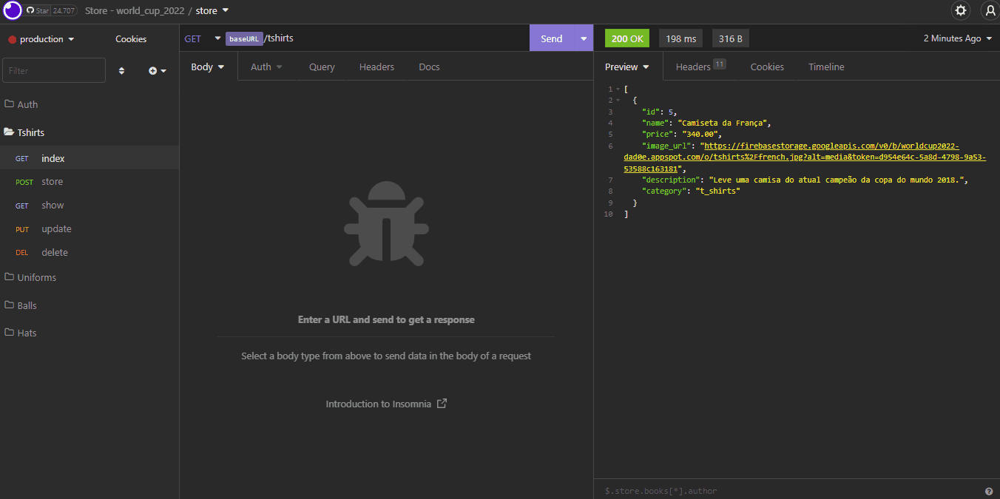
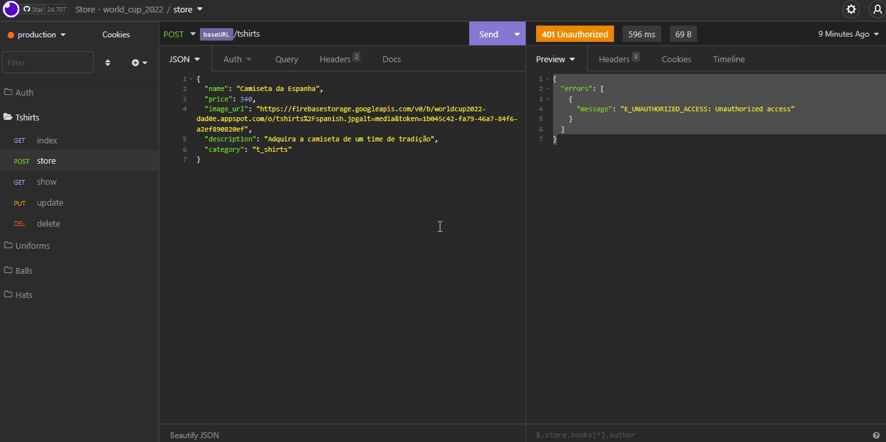
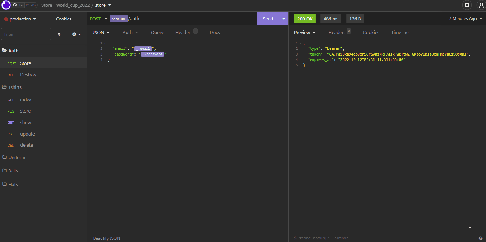
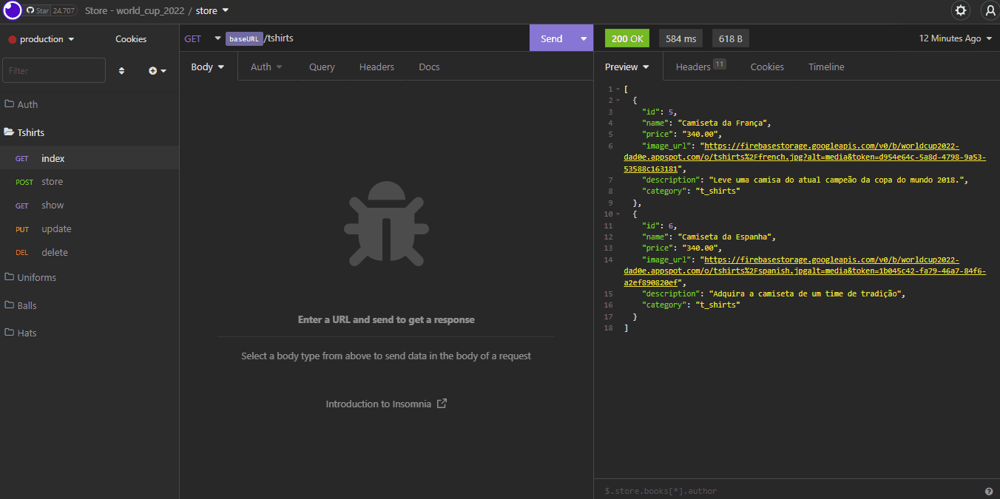

<h1 align="center"> API to 
provide the store products
</h1>
<p align="center">

</p>
</br>


## :bookmark_tabs:Summary

1. [Introduction](#Introduction)
2. [Demo](#live-demo)
3. [Features and some gif's ](#features-and-demo)
8. [Related Projects](#related-projects)


</br>
<div id="Introduction">

## :page_facing_up:Introduction

This project is an API where you can get the data from a Mysql database hosted on Hostgator, this datas are product's datas as name, description, price, image, etc.

I am using [Insomnia](https://insomnia.rest/download) software to simulate our client.
</div>


</br>
<div id="live-demo">

### :camera: [LIVE DEMO](https://api-store-xz5ip.ondigitalocean.app/) :video_camera:

This project runs on [digital ocean](https://www.digitalocean.com/) if you cannot access it means was deprecated.
</div>

</br>
<div id="features-and-demo">

## :checkered_flag: Features

Here you will see the main resources used in this project, as well as some Gif's.

### :closed_lock_with_key: Auth :key:
I added authentication middleware to allow only authenticated people to access the following methods:

| Controllers Methods  |  HTTP methods
|--- |--- 
| store | POST 
| update | PUT
| destroy | DELETE

The gif below shows an attempt to use the store method to create a new product in the tshirt category with no authentication.


</br>

To log in, an email and password is required, they should be registered in your table ````users```` in your database. (gif below)


</br>

Now let's try to store that new tshirt. (gif below)


</br>

As we can see, it is now allowed to store a new product. This process is repeated for the other ````update and delete```` methods.
</br>

### Controller methods for doing  CRUD operations

| Controllers Methods  |  HTTP methods
|--- |--- 
| index | GET 
| store | POST 
| show | GET 
| update | PUT
| destroy | DELETE

The gif below shows all these methods working.


</br>

The other routes like ````/uniforms```` ````/balls```` ````/hats```` working the same way
</div>

</br>
<div id="related-projects">

## :newspaper: See other related projects  :newspaper:

This API is based on [Store World Cup](https://github.com/Jabes-Enock/Store-cup-2022-bootstrap) project which is an e-commerce template website that sells some products related to world cup 2022. Below there is a preview of site.
      


</div>

</br></br>

### :eyes: This documentation will be updated as soon as possible :eyes:

</br></br>
Made with :heart: by Jabes Enock